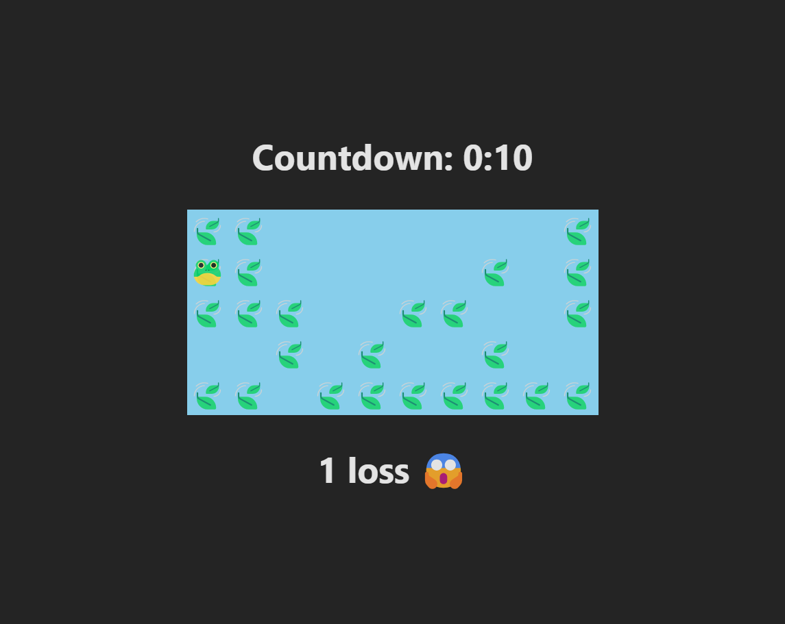

# Froggy Frolic



Hop your way to the right hand side of the pond. Be sure not to fall in the water!

# Getting started

1. Set up [Node.js](https://nodejs.org/en/download/package-manager)
2. Clone this project

```sh
git clone https://github.com/brandonp2412/FroggyFrolic
```

3. Install dependencies

```sh
cd FroggyFrolic
npm install
```

4. Run the website

```sh
npm run dev

> froggy-frolic@0.0.0 dev
> vite

Re-optimizing dependencies because lockfile has changed

  VITE v5.4.8  ready in 128 ms

  ➜  Local:   http://localhost:5173/
  ➜  Network: use --host to expose
  ➜  press h + enter to show help
```

5. Open your web browser to [http://localhost:5173](http://localhost:5173)